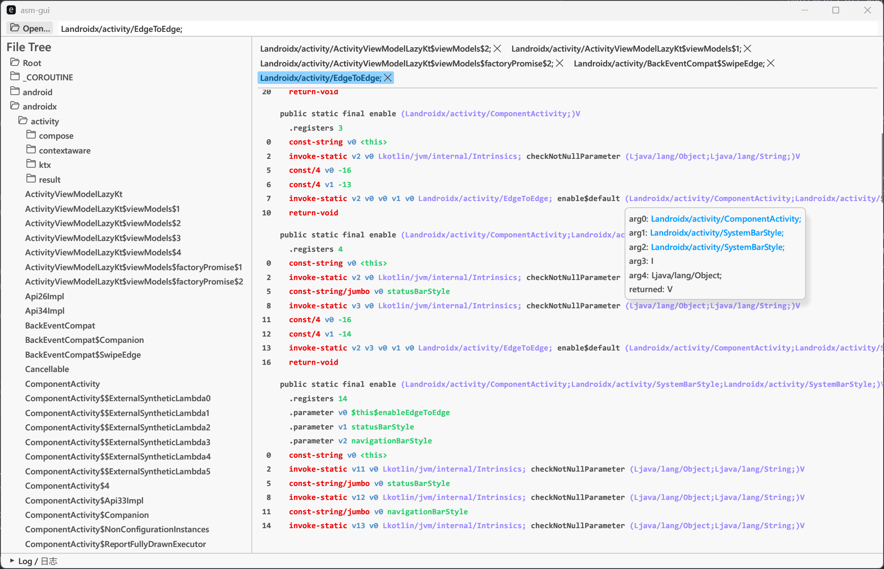

# java-asm

Java bytecode reader & writer, maybe a rust implementation for [ASM](https://gitlab.ow2.org/asm/asm)

There are some similar projects in GitHub, but they didn't actually implement all JVM Bytecode format, and also not
implements all ASM nodes/features in rust. 
So I want to build this library to fully read and write Java bytecode information.

This project supports much newer LTS Java version(Java 21 currently) than other rust implementations. Only supports 
`asm-tree` api currently, not supports visitor api because Tree API is much easier to use than visitor api.

## GUI

We have a simple GUI build by egui to show decompiled files. but current support only for apk, and we are actively
working on it.

## Current Stage

After version 0.0.6, you can try to use `ClassNode::from_jvms` to read a class file into a `ClassNode`, 
and it is pretty useful to now, check [tests](asm/tests/node/read_test.rs) in this project to 
see some examples.

- [x] Implement **Read** Java class file with **[JVMS](https://docs.oracle.com/javase/specs/jvms/se21/html/jvms-4.html)** format
- [x] Implement **Write** Java class file with **[JVMS](https://docs.oracle.com/javase/specs/jvms/se21/html/jvms-4.html)** format
- [ ] **WIP**, `ClassNode` reader
  - [x] Constant pool
  - [x] Attributes
  - [x] Class / Field / Method metadata
  - [x] Method instructions
  - [ ] Method frames (read as an attribute is available, need a better format)
  - [ ] Method local variables / stacks / try-catches (read as an attribute is available, need a better format)
- [ ] **Not Start**, Nodes writer (low priority currently)
  - [ ] Append constant pool if needed
  - [ ] Write back attributes into Class / Field / Method / Code
  - [ ] Method frames
- [ ] **Not Start**, Implement ASM features (eg. auto calculate frame/stack etc.)
- [x] Smali liked output.
- [ ] Dex interop. (https://source.android.com/docs/core/runtime/dex-format)
  - [x] Basic structure for dex file metadata
  - [x] Instructions
  - [x] Annotations
  - [ ] Debug info
  - [ ] Other formats
  - [x] Separation for metadata with real data (e.g. instructions)
- [ ] Isolate AsmResult as multiple different errors, and provide a better error message.
- [ ] GUI interactions
  - [ ] GUI backend:
    - [x] add progress when loading files
    - [ ] unzip (whatever jar or dex) & parallel read
    - [x] retrieve metadata and combine multiple metadata for better indexing
    - [x] using metadata to get the real data if needed (e.g. method instructions)
    - [ ] search content, quick search for metadata and slow search for instructions.
    - [ ] export sources / fake smali?
  - [ ] EGUI frontend. (`asm_egui` folder)
    - [x] basic window with egui.
    - [x] load files from the backend
    - [x] add progress bar UI when loading files
    - [x] show metadata in a tree view
    - [x] show instructions in a list view
    - [x] quick jump to specific metadata
    - [x] search classes
    - [x] jump to offset or type descriptor
    - [ ] Settings (e.g. custom fonts, theme, etc.)
    - [ ] decompiling by using mapping file.
  - [ ] Tauri frontend. (`ta` folder)
    > Recent days, I think using tauri will bring us a better UX, so I decided to use tauri for 
flexible interactions and share web technologies to boost the development. Using pure rust for frontend (egui or iced solution) 
is complex for handle so many things (like font fallbacks, search bars, code highlighting and copy & paste, etc.)

### Goals

1. Fully read and write Java class file with JVMS format.
2. Partially implement ASM features in rust, but provides some better operations in rust.
3. Support much newer Java version (higher priority for LTS, Java 21 currently).
4. For parser core, not depends on any of other rust libraries at runtime, build everything from std only. (but some proc marco's
   dependencies are used for generate some template codes. e.g. `quote` and `syn`)
5. Simple GUI to show decompiled jar like files. e.g. dex, apk, jar, class files.

---

Some similar projects:

- [rjvm](https://github.com/andreabergia/rjvm)
  - read jvm bytecode and run it in a rust vm
  - support JVM7
- [jvm-assembler](https://github.com/kenpratt/jvm-assembler)
- [Ka-Pi](https://github.com/ChAoSUnItY/Ka-Pi)
- [cfsp](https://github.com/ChAoSUnItY/cfsp)

